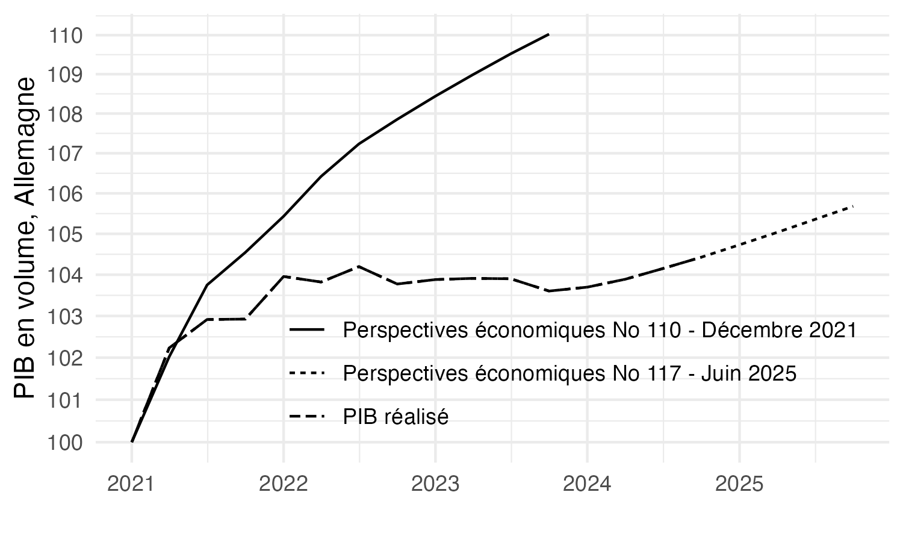
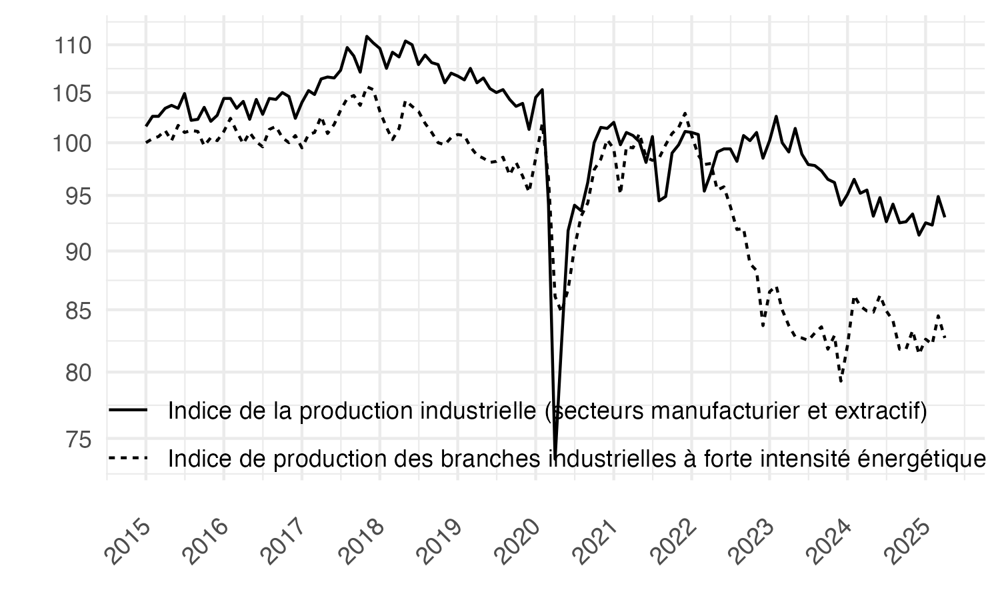

# L’Europe face au retour de l’énergie chère

Ce dépôt met à disposition des codes de réplication pour les graphiques du chapitre dans l'Economie Européenne 2026 "L’Europe face au retour de l’énergie chère".

## Figure 1: Prévisions de PIB, PIB réalisé en Allemagne (2021-Q1=100)

[Code R](figure1.R)

## Figure 2: Indices de production industrielle, Allemagne (2021=100)

[Code R](figure2.R)

